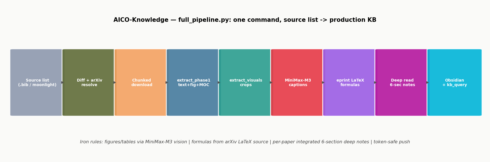
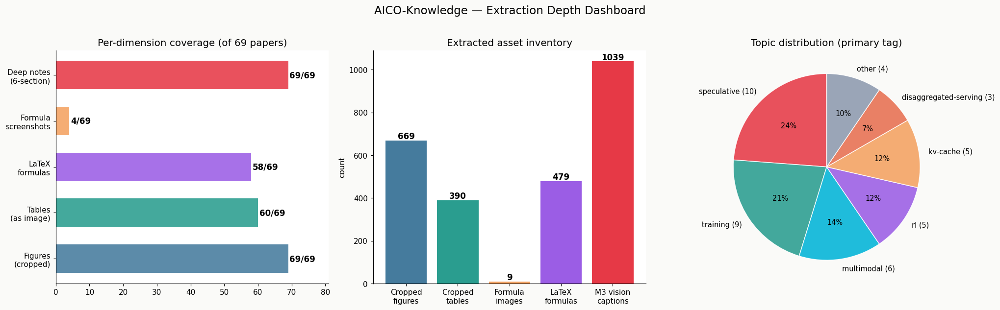
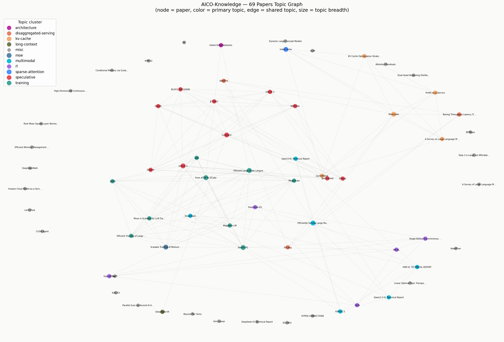

# AICO-Knowledge

> **论文 × 代码仓双域**生产级深度萃取知识库：
> **69 篇** LLM 系统/推理/训练论文（每张图/表/公式可被工程直接取用：裁剪单图 + MiniMax-M3 多模态解读 + arXiv LaTeX 权威公式 + 一体化深读 + 跨元素关联）
> **+ 134 个代码仓**（Ascend 组织全量 + xLLM-AI 全量 + vllm/vllm-ascend：**21,954 篇文档**收割分类 + 版本血缘追踪 + 仓卡片）。
> Obsidian 图谱化 + RAG 友好 + Wiki 簿记层。



## 知识库架构（Karpathy LLM Wiki 三层落地）

参考 [Karpathy LLM Wiki](https://gist.github.com/karpathy/442a6bf555914893e9891c11519de94f) 的 **raw → wiki → schema** 三层模式：

| 层 | 本库落地 | 谁写 |
|---|---|---|
| **Raw sources**（不可变事实源） | `papers/` PDF + `archive/paper_source_moonlight.bib` + `repos_src/` 稀疏克隆（blob:none，可重拉） | 用户策展 |
| **Wiki**（LLM 全权维护） | `extraction/`（论文: MD/deep/MOC/captions/formulas · 代码仓: repo_inventory/repo_docs/repo_docs_index/repo_cards/deep/repo-*）+ `wiki/concepts/` 概念页 + `extraction/index.md` 内容目录 + `extraction/log.md` 编年日志 | LLM |
| **Schema**（规范） | `skills/paper-extraction/SKILL.md` + `skills/repo-extraction/SKILL.md` + `DEEP_LEARNING_PROTOCOL.md` + 各脚本 docstring | 人与 LLM 共演进 |

**三个操作（持续复利）**：

1. **Ingest** — `full_pipeline.py --push` 一条命令（10 步：sync → 萃取 → 裁剪 → M3 解读 → 公式 → 合并 → **Lint gate** → 深读队列 → Wiki 索引 → push）
2. **Query** — 先读 `extraction/index.md`（LLM-reads-first 目录）定位，再钻取；机器走 `kb_query.py --json`。**好答案回填**到 `wiki/concepts/` 复利增长
3. **Lint** — 全量机审（M3 逐张判决 → 二阶白名单 → 规则重裁 → 复核闭环）；夜间深读 cron 顺带做

## 为什么这个知识库不一样

普通知识仓 = 一堆 PDF + 摘要，或一堆 git clone。本库对**论文和代码仓两个域**都做了全要素深度加工，
且两域知识互相锚定（glm5.3-flash 适配：论文 KDA/DSA 方法源 ↔ xllm 仓官方实现 ↔ MindSpeed 仓特性文档三方互证）。

### 代码仓域（2026-09 新增 · repo-extraction）

| 能力 | 做法 | 效果 |
|---|---|---|
| **大仓低成本归档** | `--filter=blob:none` + no-cone sparse-checkout：全 tree 免费（git ls-tree），blob 只拉文档与元数据 | 1516 文件的 MindSpeed 只下载 39MB；134 仓全量仅 1.9GB |
| **文档全量收割分类** | 路径启发式九类（feature/api/guide/changelog/readme/design/faq/overview/doc），大纲/图片/内部链接全登记 | 21,954 篇文档索引化；特性文档互链可直接生成特性关系图 |
| **版本血缘追踪** | inventory 每仓记录 tag/HEAD/版本候选 + **snapshots 追加式历史**（重拉自动保留旧快照） | 仓更新后可做版本间知识 diff 与关联（卡片标注版本线：如 xllm v0.10.1 · GLM-5.3-Flash day-0 时间线） |
| **机械层/分析层双层写入** | `repo_cards/` 骨架无限重生成，`deep/repo-*` 卡片只播种不覆盖 | LLM 深读内容永不丢失（extract_phase1 overwrite 教训的制度化） |

### 论文域（paper-extraction）

普通论文仓 = 一堆 PDF + 摘要。本库对每篇论文做了**全要素深度加工**，四条铁律保证质量：

| 铁律 | 做法 | 效果 |
|---|---|---|
| **图/表理解全走多模态** | 所有架构图/数据流图/表格经 MiniMax-M3 vision 逐张解读，写进 `minimax_captions.json`；**上下文增强**：crop + 论文正文引用段落联合喂 M3（`context_caption.py`，图文锚定原文论述） | 不是"有图"，是"每张图都有可读的技术解读" |
| **公式以 arXiv LaTeX 源为权威** | e-print 源码抽取，禁止凭训练知识重写；无 LaTeX 源的论文公式裁成原文截图 | `$$` 块直接渲染、完全正确，可粘贴进报告 |
| **按论文维度一体化深读** | 全文+图+表+公式交织成 6 段结构，前后文一致；图/表/公式/文本**跨元素关联**自动聚合到 `## 方法链` 顶层章节 | 不是孤立片段，是吃透整篇的结构化笔记 |
| **新增论文一遍过**（2026-08-25 落地） | `full_pipeline.py` step 7 永久内置 `audit_crops → discriminate_audit → autofix_crops` Lint gate；新论文入库自动机审→白名单→规则重裁闭环 | 不需人工校验，95.5% 一遍过；剩余 hard-case 落 `ar5iv_crops.json`（manual-pdf-region）享 overlay 保护 |

## 工作原理（10 步流水线）

`python3 skills/paper-extraction/full_pipeline.py --push` 自动完成：

```
① sync_from_source       源表 diff → arxiv 解析 → 下载体检 → 索引追加
② extract_phase1         文本 + 图表 + MOC + manifest
③ extract_visuals        图/表/公式区域裁剪成单图 assets/crops/
④ m3_caption (上下文)    crop + 论文引用段落联合喂 M3 → 解读
⑤ eprint_formulas        arxiv LaTeX 源（无网自动跳过）
⑥ extract_phase1 (merge) 4/5 的增量嵌进 MD
⑦ ⭐ Lint gate            audit → discriminate → autofix 全库机审闭环
⑧ orchestrate_deep_reread 新论文全要素深读队列（夜间执行）
⑨ wiki_index             index.md 重建 + 概念页种子 + log.md 记帐
⑩ token-safe commit+push 推完抹 push URL token，绝不落仓
```

幂等：无新增时 ~1-2 分钟完成。新增论文 = 一次 `full_pipeline.py --push` 即可。

## 代码仓流水线（repo-extraction，3 阶段）

输入 = `repos_download_list.txt`（slug | git_url | ref | 备注，镜像论文清单）：

```bash
python3 skills/repo-extraction/repo_fetch.py          # ① 稀疏拉取+清单 → repo_inventory.json
python3 skills/repo-extraction/repo_extract_docs.py   # ② 文档收割分类 → repo_docs/ + repo_docs_index.json
python3 skills/repo-extraction/repo_card.py <slug>    # ③ 卡片骨架(机械层) → repo_cards/ + deep/repo-<slug>.md 播种
# ③b LLM 分析层: 定位/架构/关键特性深读(图走 M3 文档上下文联合解读) — 只写 deep/ 卡片, 骨架重跑不覆盖
```

当前规模（2026-09-02）：**134 仓入库**（Ascend 组织 104 + xLLM-AI 30 全量 + vllm/vllm-ascend 镜像；
llvm-project / torch-mlir 为空仓占位已标记），**21,954 篇文档**、497 篇特性文档、版本血缘 snapshots 全量在册。
已填分析层的卡片：mindspeed（含 fb-overlap 特性 3 图 M3 解读）· xllm · vllm · vllm-ascend。

**文档深读层（论文级规格，2026-09-02 全量完成）**：
**1,719 篇**高价值文档（feature/design/overview/guide/changelog 五类）逐篇 M3 七节深读 ——
定位 / 技术要点 / 机制与真实数据 / **表格逐字还原+逐行解读** / **公式逐字保留+符号解释** / 关联 / 使用方法；
带图文档**正文作上下文喂 M3 vision**，**881 张**文档图完成图文联合解读（`repo_m3_captions.json`）。
产物：`extraction/repo_deep_docs/<slug>/`（1,722 篇笔记 · 85 仓）+ `extraction/repo_deep_index.json` 索引
+ 仓卡片尾部深读链接块（机械层标记内重生成）。

## 萃取深度一图看懂



- **685 张裁剪单图**（不再是整页截图——每张 figure 独立裁剪，可直接插入报告；⭐ 727 张已 M3 深度解读）
- **429 张裁剪表格**（表格第一次成为"可插入的图"，不再只是 Markdown 文本）
- **479 条 LaTeX 权威公式**（58 篇）+ **4 张公式截图**（无 LaTeX 源论文兜底，引用前核对）
- **1600+ 条 MiniMax-M3 多模态解读**（架构图/数据流图/表格逐张技术解读；全部裁剪图均为**图文联合解读**——论文正文引用段落 + 图片联合喂 M3，解读锚定原文论述）
- **69 篇 6 段深读笔记**（核心问题/关键创新点(机制+效果+精确数字+公式+图解读)/表格/对比/谱系/局限）
- **69 篇「## 方法链」跨元素章节**（每篇 MD 顶部自动聚合图/表/公式的论证作用，按论文链顺序串联）
- **19 页原子概念页**（`wiki/concepts/`，跨论文累积综合 + 谱系嵌入，Obsidian 图谱 hub）
- **96 张坏字体/坏结构论文裁剪**（ar5iv 原图/手工区域保护）

## 知识图谱（主题聚类 + 跨论文谱系）



> 节点=论文，颜色=主主题，边=共享主题。Obsidian 打开本仓 → `extraction/MOC.md` 可视化交互式图谱；跨论文演进谱系见 `extraction/moc_relations.md`。

## 快速取用（生产级工作流）

**统一查询入口 `kb_query.py`**（全部子命令支持 `--json`，agent/RAG 程序化消费）；**LLM 读库先读 `extraction/index.md`**（内容目录，按主题定位论文/概念页，再钻取细节）：

```bash
KB=skills/paper-extraction/kb_query.py
python3 $KB stats                        # 库总量
python3 $KB search speculative decoding  # 论文检索
python3 $KB fig moe dispatch             # 按 caption 找图 → 裁剪图 embed + 引用串
python3 $KB formula softmax              # 按内容找 LaTeX 公式（$$ 直贴，权威正确）
python3 $KB topics                       # 主题 → 论文映射
python3 $KB info <slug>                  # 单篇全卡片
```

> 📚 **LLM Wiki 三层架构**（参考 [Karpathy LLM Wiki](https://gist.github.com/karpathy/442a6bf555914893e9891c11519de94f)）：raw（`papers/` 不可变）→ wiki（`extraction/` + `wiki/concepts/`，LLM 全权维护）→ schema（`SKILL.md`）。三个操作：**Ingest**=`full_pipeline.py` 一条命令；**Query**=先读 index.md 再钻取，好答案回填 `wiki/` 复利增长；**Lint**=全量机审（M3 逐张判决 → 二阶白名单 → 规则重裁 → 复核闭环）。编年动态见 `extraction/log.md`（`grep "^## \[" extraction/log.md | tail -5`）。

**写报告插图**：`kb_query.py fig <关键词>` → 拿裁剪单图 `![[assets/crops/<slug>-figNN.png]]` + `[slug, Fig.N, p.X]` 引用串。图已是干净单元素裁剪，不用再裁。

**引用表格**：单篇 MD 的「表格」节有裁剪表格图 + caption + M3 解读，直接 embed。

**引用公式**：`kb_query.py formula <关键词>` → 复制 `$$` 块（arXiv LaTeX 源，权威正确）。无 LaTeX 源的论文在「关键公式（原文截图）」节。

**取深度分析**：`extraction/deep/<slug>.md`（6 段一体化，图表+公式已织入，前后文一致）。

## 目录结构

```
AICO-knowledge/
├── papers/                          # 源 PDF（69 篇，不可变 raw 层）
├── papers_effective.md              # 主索引（清单+链接+本地状态）
├── archive/                         # 源策展（paper_source_moonlight.bib = 用户唯一要维护的文件）
├── skills/paper-extraction/         # ⭐ 可复用 skill（clone 即用）
│   ├── full_pipeline.py             #   ⭐ 10 步全链路一条命令（source→KB→push）
│   ├── sync_from_source.py          #   源表 diff→下载→萃取→推送
│   ├── extract_phase1.py            #   深度萃取（merge 解读+公式+裁剪图 + Wiki 簿记）
│   ├── extract_visuals.py           #   图/表/公式区域裁剪成单图
│   ├── context_caption.py           #   ⭐ 上下文增强 M3 解读（crop + 正文引用段落联合喂 M3）
│   ├── audit_crops.py               #   ⭐ Lint gate step 1：全库 M3 逐张判决
│   ├── discriminate_audit.py        #   ⭐ Lint gate step 2：二阶白名单
│   ├── autofix_crops.py             #   ⭐ Lint gate step 3：规则重裁闭环
│   ├── cross_element_synthesis.py   #   ⭐ 每篇 MD 顶部聚合 fig/tab/eq 论证 → 方法链章节
│   ├── wiki_index.py                #   📚 LLM Wiki 簿记层（index.md + 概念页种子 + log.md）
│   ├── render_kb_graph.py           #   知识图谱+覆盖统计图生成
│   ├── m3_caption.py                #   MiniMax-M3 图/表多模态解读
│   ├── eprint_formulas.py           #   arXiv e-print LaTeX 公式抽取
│   ├── kb_query.py                  #   统一查询 CLI（--json）
│   ├── chunk_download.py            #   分块续传下载
│   └── verify_pdfs.py               #   PDF 体检（CI gate）
├── wiki/
│   └── concepts/<slug>.md           # 📚 19 页原子概念页（跨论文综合，图谱 hub）
├── extraction/                      # 生成的知识库（LLM 维护的 wiki 层）
│   ├── index.md                     #   📚 LLM-reads-first 内容目录（先读定位再钻取）
│   ├── log.md                       #   📚 编年日志（ingest/lint/pipeline 动态）
│   ├── <slug>.md                    #   每篇结构化解析（摘要/方法链/裁剪图/表格/公式/相关论文）
│   ├── deep/<slug>.md               #   ⭐ 6 段一体化深读（图/表/公式织入）
│   ├── fulltext/<slug>.txt          #   全文纯文本（RAG chunk 源）
│   ├── assets/<slug>-pNN.png        #   整页渲染（150 DPI）
│   ├── assets/crops/<slug>-figNN.png  # ⭐ 裁剪单图（报告直接插入）
│   ├── assets/crops/<slug>-tabNN.png  # ⭐ 裁剪表格
│   ├── assets/crops/<slug>-eqNN.png   # ⭐ 公式截图（无 LaTeX 源兜底）
│   ├── figures_index.md             #   图表主索引（⭐精选+主题分类+按论文）
│   ├── MOC.md                       #   主题图谱导航（Obsidian 图谱视图）
│   ├── moc_relations.md             #   跨论文关系谱系（人工维护）
│   ├── papers.json                  #   机器可读 manifest（RAG 摄取入口）
│   ├── formulas.json                #   LaTeX 公式库（58 篇 479 条，权威源）
│   ├── visuals.json                 #   裁剪图 manifest（fig/tab/eq）
│   ├── ar5iv_crops.json             #   坏字体/坏结构 PDF 的 ar5iv 替换+手工区域保护清单
│   ├── minimax_captions.json        #   多模态解读（1600+ 条）
│   └── crop_audit.json              #   Lint gate 审计结果（机审判决 + 复核状态）
└── docs/images/                     # 知识图谱/覆盖统计/流水线图（README 嵌入）
```

## 增量更新（一条命令）

唯一人工动作 = 更新源文件（`archive/paper_source_moonlight.bib` 或 `.md`），然后：

```bash
python3 skills/paper-extraction/full_pipeline.py --push
```

自动：源表 diff → arXiv 解析 → 分块下载+体检 → 萃取 → **图/表/公式裁剪** → **上下文增强 M3 批量解读新增** → LaTeX 公式 → 深读队列 → **Lint gate（机审→白名单→规则重裁闭环）** → Wiki 簿记 → token-safe push。幂等，无新增 ~1-2 分钟。

## 主题覆盖

speculative decoding（10 篇成簇：EAGLE 全家族/Medusa/SpecExtend/LongSpec…）｜kv-cache（Mooncake/CacheBlend/Prefill-as-a-Service…）｜training（Megatron/MegaScale/ZeRO/Muon…）｜moe（Scalable-MoE/OmniMoE…）｜rl（DeepSeek-R1/GRPO/DAPO/AREAL/HybridFlow/CUDA-Agent…）｜multimodal（Qwen3-VL/Kimi-VL…）｜disaggregated-serving（Sarathi/NanoFlow/SGLang…）｜long-context / sparse-attention / architecture / topic-modeling / relational-table

## 文档

- `skills/paper-extraction/SKILL.md` — 操作手册（全链路 + agent 收尾 + 决策树 + 踩坑 + Wiki 三层架构）
- `skills/paper-extraction/DEEP_LEARNING_PROTOCOL.md` — 夜间深度学习规范
- `extraction/README.md` — 知识库使用说明 + 外部工程接入指南
- `EXPERIENCE.md` — 建库全过程踩坑与解法复盘
- `docs/fixed-crops-2026-08-25.md` — 本轮 Lint gate 修复的裁剪清单

---

**现状（2026-08-25）**：69 唯一论文 ｜ 685 裁剪图 + 429 裁剪表 + 4 公式截图 ｜ 479 LaTeX 公式（58 篇） ｜ 727 ⭐ M3 深度解读（图/表/公式逐张） ｜ 1600+ 图文联合解读（crop+正文段落联合喂 M3） ｜ 69 篇 6 段深读 + 69 篇「方法链」跨元素章节 ｜ 19 页概念页 + index.md/log.md 簿记层（Karpathy LLM Wiki 落地） ｜ 96 张坏字体/坏结构论文裁剪由 ar5iv 原图/手工区域保护 ｜ PDF 0 截断 ｜ Lint gate 全量机审闭环（95.5% 一遍过） ｜ 四铁律全绿。
