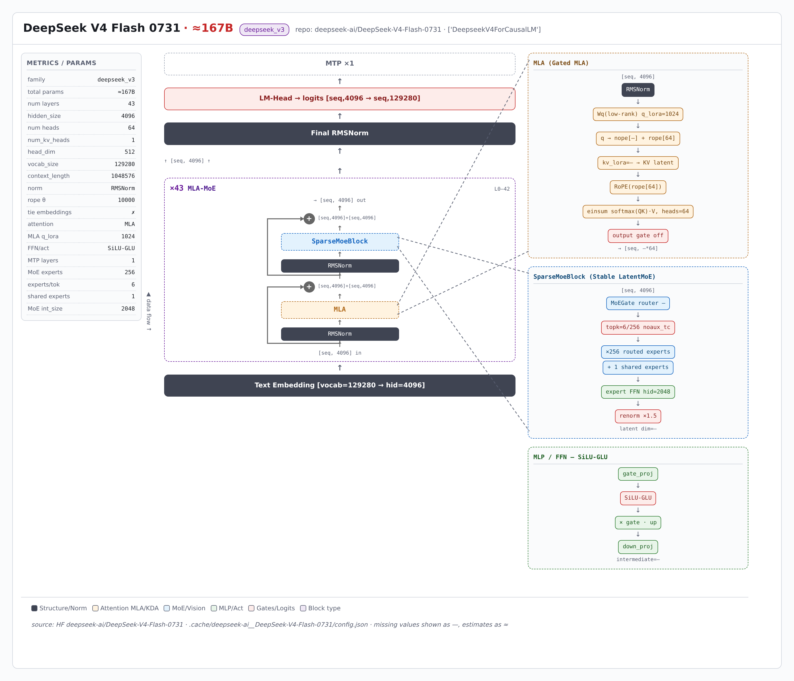

> 本页由 model-arch 技能从 HuggingFace `deepseek-ai/DeepSeek-V4-Flash-0731` 的 config.json 实时解析生成（非人工绘制）；可交互版结构图：[deepseek_v4/deepseek_v4_arch.html](deepseek_v4/deepseek_v4_arch.html)（自包含单文件，浏览器打开）

---

# DeepSeek V4 Flash 0731 架构简介

DeepSeek V4 Flash 0731 架构分析（由 model-arch skill 从HuggingFace `deepseek-ai/DeepSeek-V4-Flash-0731`实时抓取 `config.json` 与 modeling 代码自动生成）。模型族：**deepseek_v3**，model_type `deepseek_v4`。

## 整体架构

  

## 模块说明

主要参数如下（来源：HuggingFace `deepseek-ai/DeepSeek-V4-Flash-0731`的 `config.json` 与 modeling 代码）：

| 指标 | 值 |
|---|---|
| 架构族 | deepseek_v3 |
| model_type | deepseek_v4 |
| 总参数（估算） | ≈167B |
| 层数 | 43 |
| 隐藏维度 | 4096 |
| 注意力头数 | 64 |
| KV 头数 | 1 |
| head_dim | 512 |
| 词表大小 | 129280 |
| 上下文长度 | 1048576 |
| 归一化 | RMSNorm |
| RoPE θ | 10000 |
| tie embeddings | ✗ |
| 注意力机制 | MLA |
| MLA q_lora_rank | 1024 |
| qk_nope / rope / v head_dim | None / 64 / None |
| FFN/激活 | SiLU-GLU |
| MTP 层数 | 1 |
| MoE 专家数 | 256 |
| 每 token 激活专家 | 6 |
| 共享专家 | 1 |
| MoE 每专家隐层 | 2048 |
| 路由激活/归一 | None / True |
| 路由 topk 法 | noaux_tc |
| block 堆栈 | 43×MLA-MoE |

### 语言模块

语言主干：**43 层**，block 堆栈 `43×MLA-MoE`。注意力 MLA（q_lora=1024, kv_lora=—），FFN SiLU-GLU。MoE：256 专家 / 每 token 激活 6 / 1 共享专家。 MTP 1 层。

代码级佐证（modeling 文件中的实现类）：—。

### 视觉模块

（本模型为纯文本模型，无视觉模块。）

## 相关资料

- [模型卡片与权重（Hugging Face）](https://huggingface.co/deepseek-ai/DeepSeek-V4-Flash-0731)
- 本报告由 [model-arch skill](.) 自动生成，数值取自 `config.json` 真实字段，缺失项标「—」。
