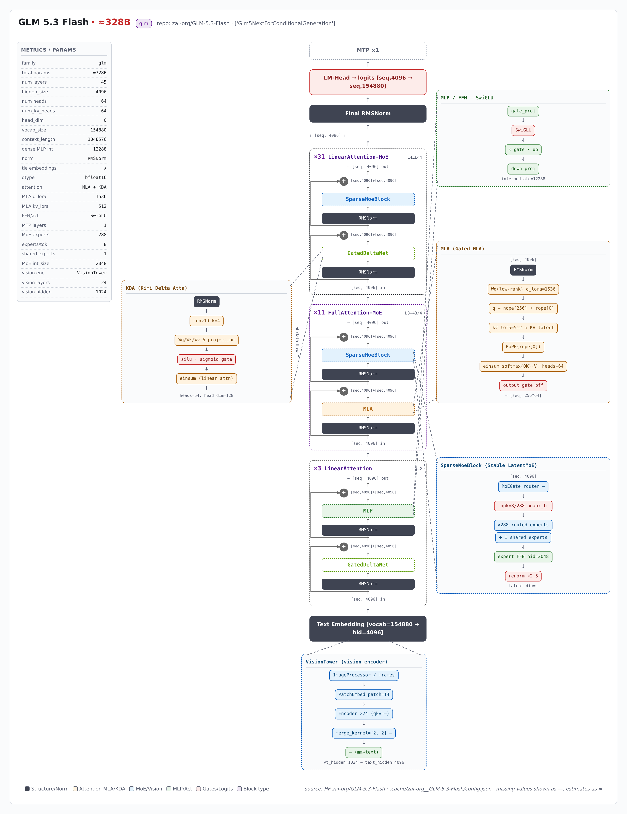

> 本页由 model-arch 技能从 HuggingFace `zai-org/GLM-5.3-Flash` 的 config.json 实时解析生成（非人工绘制）；可交互版结构图：[glm_5_3_flash/glm_5_3_flash_arch.html](glm_5_3_flash/glm_5_3_flash_arch.html)（自包含单文件，浏览器打开）

---

# GLM 5.3 Flash 架构简介

GLM 5.3 Flash 架构分析（由 model-arch skill 从HuggingFace `zai-org/GLM-5.3-Flash`实时抓取 `config.json` 与 modeling 代码自动生成）。模型族：**glm**，model_type `glm5_next`。

## 整体架构

  

## 模块说明

主要参数如下（来源：HuggingFace `zai-org/GLM-5.3-Flash`的 `config.json` 与 modeling 代码）：

| 指标 | 值 |
|---|---|
| 架构族 | glm |
| model_type | glm5_next |
| 总参数（估算） | ≈328B |
| 层数 | 45 |
| 隐藏维度 | 4096 |
| 注意力头数 | 64 |
| KV 头数 | 64 |
| head_dim | 0 |
| 词表大小 | 154880 |
| 上下文长度 | 1048576 |
| 稠密 MLP 隐层 | 12288 |
| 归一化 | RMSNorm |
| tie embeddings | ✗ |
| 注意力机制 | MLA + KDA |
| MLA q_lora_rank | 1536 |
| MLA kv_lora_rank | 512 |
| qk_nope / rope / v head_dim | 256 / 0 / 256 |
| FFN/激活 | SwiGLU |
| MTP 层数 | 1 |
| MoE 专家数 | 288 |
| 每 token 激活专家 | 8 |
| 共享专家 | 1 |
| MoE 每专家隐层 | 2048 |
| 路由激活/归一 | None / True |
| 路由 topk 法 | noaux_tc |
| 视觉层数/维度 | 24 / 1024 |
| 视觉 merge | [2, 2] |
| block 堆栈 | 3×LinearAttention + 11×FullAttention-MoE + 31×LinearAttention-MoE |

### 语言模块

语言主干：**45 层**，block 堆栈 `3×LinearAttention + 11×FullAttention-MoE + 31×LinearAttention-MoE`。注意力 MLA + KDA（q_lora=1536, kv_lora=512），FFN SwiGLU。MoE：288 专家 / 每 token 激活 8 / 1 共享专家。 MTP 1 层。

代码级佐证（modeling 文件中的实现类）：—。

### 视觉模块

视觉模块：—，24 层，维度 1024，patch 14，merge [2, 2] (—)，投影 —。

## 相关资料

- [模型卡片与权重（Hugging Face）](https://huggingface.co/zai-org/GLM-5.3-Flash)
- 本报告由 [model-arch skill](.) 自动生成，数值取自 `config.json` 真实字段，缺失项标「—」。
