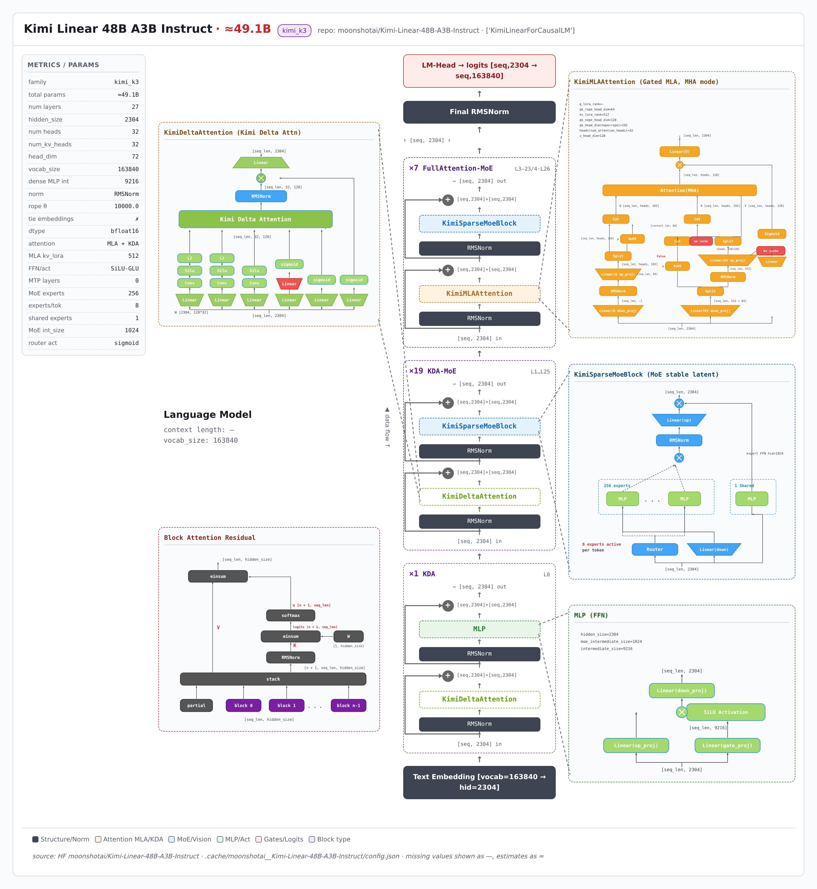

> 本页由 model-arch 技能从 HuggingFace `moonshotai/Kimi-Linear-48B-A3B-Instruct` 的 config.json 实时解析生成（非人工绘制）；可交互版结构图：[kimi_linear/kimi_linear_arch.html](kimi_linear/kimi_linear_arch.html)（自包含单文件，浏览器打开）

---

# Kimi Linear 48B A3B Instruct 架构简介

Kimi Linear 48B A3B Instruct 架构分析（由 model-arch skill 从HuggingFace `moonshotai/Kimi-Linear-48B-A3B-Instruct`实时抓取 `config.json` 与 modeling 代码自动生成）。模型族：**kimi_k3**，model_type `kimi_linear`。

## 整体架构

  

## 模块说明

主要参数如下（来源：HuggingFace `moonshotai/Kimi-Linear-48B-A3B-Instruct`的 `config.json` 与 modeling 代码）：

| 指标 | 值 |
|---|---|
| 架构族 | kimi_k3 |
| model_type | kimi_linear |
| 总参数（估算） | ≈49.1B |
| 层数 | 27 |
| 隐藏维度 | 2304 |
| 注意力头数 | 32 |
| KV 头数 | 32 |
| head_dim | 72 |
| 词表大小 | 163840 |
| 稠密 MLP 隐层 | 9216 |
| 归一化 | RMSNorm |
| RoPE θ | 10000.0 |
| tie embeddings | ✗ |
| 注意力机制 | MLA + KDA |
| MLA kv_lora_rank | 512 |
| qk_nope / rope / v head_dim | 128 / 64 / 128 |
| FFN/激活 | SiLU-GLU |
| MTP 层数 | 0 |
| MoE 专家数 | 256 |
| 每 token 激活专家 | 8 |
| 共享专家 | 1 |
| MoE 每专家隐层 | 1024 |
| 路由激活/归一 | sigmoid / True |
| block 堆栈 | 1×KDA + 19×KDA-MoE + 7×FullAttention-MoE |

### 语言模块

语言主干：**27 层**，block 堆栈 `1×KDA + 19×KDA-MoE + 7×FullAttention-MoE`。注意力 MLA + KDA（q_lora=—, kv_lora=512），FFN SiLU-GLU。MoE：256 专家 / 每 token 激活 8 / 1 共享专家。 无 MTP。

代码级佐证（modeling 文件中的实现类）：KDA: KimiDeltaAttention、MLA: KimiMLAAttention、MoE_gate: KimiMoEGate、MoE_block: KimiSparseMoeBlock。

### 视觉模块

（本模型为纯文本模型，无视觉模块。）

## 相关资料

- [模型卡片与权重（Hugging Face）](https://huggingface.co/moonshotai/Kimi-Linear-48B-A3B-Instruct)
- 本报告由 [model-arch skill](.) 自动生成，数值取自 `config.json` 真实字段，缺失项标「—」。
