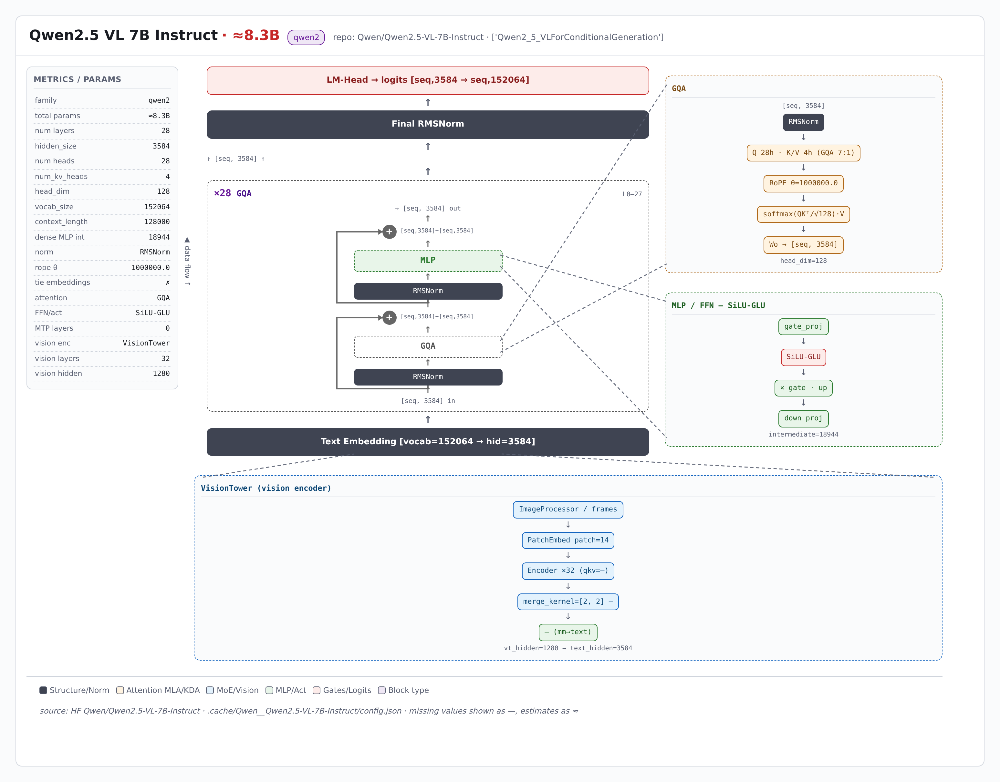

> 本页由 model-arch 技能从 HuggingFace `Qwen/Qwen2.5-VL-7B-Instruct` 的 config.json 实时解析生成（非人工绘制）；可交互版结构图：[qwen2_5_vl/qwen2_5_vl_arch.html](qwen2_5_vl/qwen2_5_vl_arch.html)（自包含单文件，浏览器打开）

---

# Qwen2.5 VL 7B Instruct 架构简介

Qwen2.5 VL 7B Instruct 架构分析（由 model-arch skill 从HuggingFace `Qwen/Qwen2.5-VL-7B-Instruct`实时抓取 `config.json` 与 modeling 代码自动生成）。模型族：**qwen2**，model_type `qwen2_5_vl`。

## 整体架构

  

## 模块说明

主要参数如下（来源：HuggingFace `Qwen/Qwen2.5-VL-7B-Instruct`的 `config.json` 与 modeling 代码）：

| 指标 | 值 |
|---|---|
| 架构族 | qwen2 |
| model_type | qwen2_5_vl |
| 总参数（估算） | ≈8.3B |
| 层数 | 28 |
| 隐藏维度 | 3584 |
| 注意力头数 | 28 |
| KV 头数 | 4 |
| head_dim | 128 |
| 词表大小 | 152064 |
| 上下文长度 | 128000 |
| 稠密 MLP 隐层 | 18944 |
| 归一化 | RMSNorm |
| RoPE θ | 1000000.0 |
| tie embeddings | ✗ |
| 注意力机制 | GQA |
| FFN/激活 | SiLU-GLU |
| MTP 层数 | 0 |
| 视觉层数/维度 | 32 / 1280 |
| 视觉 merge | [2, 2] |
| block 堆栈 | 28×GQA |

### 语言模块

语言主干：**28 层**，block 堆栈 `28×GQA`。注意力 GQA，FFN SiLU-GLU。 无 MoE。 无 MTP。

代码级佐证（modeling 文件中的实现类）：—。

### 视觉模块

视觉模块：—，32 层，维度 1280，patch 14，merge [2, 2] (—)，投影 —。

## 相关资料

- [模型卡片与权重（Hugging Face）](https://huggingface.co/Qwen/Qwen2.5-VL-7B-Instruct)
- 本报告由 [model-arch skill](.) 自动生成，数值取自 `config.json` 真实字段，缺失项标「—」。
