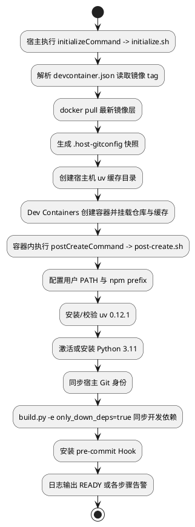

# 特性设计

> 仓 `msmodeling` · 路径 `docs/design/msmodeling_dev_environment_design.md` · 类型 design · MiniMax-M3 文档深读 + 图文关联 · ver=v2
> 原文: extraction/repo_docs/msmodeling/docs/design/msmodeling_dev_environment_design.md

# msmodeling Dev Container 特性设计 —— 一体化深度解读

---

## 【定位】

本篇文档描述 **msmodeling 仓库的纯 Python Dev Container 统一开发环境方案**：在仓库内提供完整的 `.devcontainer/` 定义，使开发者通过 VS Code "Reopen in Container" 即可获得镜像、Python 3.11 解释器、`uv` 依赖、Git 公开身份、pre-commit、npm prefix、Pylance 跳转与调试/构建 Task 全部就绪且可复现的开发环境，从而收敛"开发环境因机而异"和"命令行与 IDE 行为双轨"两类痛点。

---

## 【技术要点】

1. **Dev Container 入口配置**（`.devcontainer/devcontainer.json`）：定义 MindStudio 统一构建镜像（tag 由 `devcontainer.json` 的 `image` 字段作为单一事实源）、工作区挂载 `/workspace`、容器用户、缓存挂载、`postCreateCommand`，以及 `customizations.vscode.extensions`（与 `.vscode/extensions.json` 双声明）。

2. **宿主机/容器脚本严格分离**：
   - **`.devcontainer/initialize.sh`**（宿主侧，VS Code Dev Containers 通过 `initializeCommand` 调用）：`docker pull` 最新镜像层、用 Python 的 `json.loads` 解析 `devcontainer.json` 的 `image` 字段、写 `.host-gitconfig` 公开身份快照（0600 权限）、创建宿主机 uv 缓存挂载源。
   - **`.devcontainer/post-create.sh`**（容器内，通过 `bash -lc` 的 login shell 执行，自动 source `/etc/profile.d/` 下的 CANN/GCC/Python 脚本）：分步完成 `run_step`（输出 `START/DONE/FAILED`，单步失败不终止，最终统一退出 0）—— 配置 `$HOME/.local` PATH 与 npm prefix → 安装/校验 **uv 0.12.1** → 激活或安装 **Python 3.11** → 同步宿主 Git 身份 → 同步开发依赖 → 安装 pre-commit Hook → 输出 `READY` 或告警。

3. **Git 身份收敛机制**：宿主机 `~/.gitconfig` 的 `user.name` / `user.email` 经 `.host-gitconfig` 快照以 **0600** 权限透传进容器（`/tmp/host-gitconfig`），但宿主机凭据、Token、SSH 私钥及其他 Git 配置**不进入**容器；`.host-gitconfig` 由 `.gitignore` 排除，不入版本库与镜像。

4. **依赖事实源单一化**：`uv.lock` 是 Python 依赖只读事实源，初始化与 build 都以 **`uv sync --frozen`** 同步，禁止更新；`.venv`（位于 `/workspace/.venv`）是 `uv sync` 的输出，由 Python 扩展、调试器、pytest、构建过程消费。

5. **build.py 命令行最小扩展**：新增 `-e/--extra` 白名单 key `only_down_deps`（**仅接受小写字面量 `true`/`false`**，不接受 `yes`/`1`/`TRUE`/空串）；test 模式恒为 `False`。三处代码改动：`argv.py`（`_BUILD_EXTRA_KEYS` 白名单新增 key、`_validate_extras` 改为 build/test 独立白名单）、`bootstrap.py`（`Mode` 由 `build | test` 扩展为 `build | test | development`，`ensure_deps` 映射为 `{"build": ("build",), "test": ("ci",), "development": ("build", "ci", "lint")}`）、`run_build.py`（`only_down_deps=true` 时选择 `development` 模式、同步三组依赖后**短路返回**，不调用 `_clear_wheel_output_dir` / `_set_pyproject_version` / `_run_with_version_staging`，不要求 `scripts/build.sh` 存在、不写 `artifacts/build-manifest.json`）。

6. **VS Code 任务集**（`.vscode/tasks.json` 等）：提供当前 Python 文件调试、当前 UT 文件调试、Release 构建、仅下载依赖、全量 UT、Python 工作区清理任务；Pylance 以仓库根目录和 `.venv` 为分析基础支持 F12 跳转；不创建 `.clangd`，不提供 CMake/GDB/C++ 单元测试任务（仓库纯 Python，无 C++ 编译数据库需求）。命令行入口 `python3 build.py` 与 `python3 build.py test` 在不使用 Dev Container 时仍直接可用。

---

## 【关键机制与数据】

**四阶段控制流**（原文 plantuml "逻辑流程图"）：**宿主初始化 → 容器创建 → 容器内初始化 → 日常开发**。两脚本执行位置严格分离：`initialize.sh` 跑在宿主机，`post-create.sh` 跑在容器内，通过只读挂载的 `.host-gitconfig` 快照传递 Git 身份信息。

**镜像 tag 单一事实源**：`initialize.sh` **不重复维护镜像名**，而是用 Python `json.loads` 解析 `devcontainer.json` 的 `image` 字段；每次重建容器前强制 `docker pull` 该 tag，**防止官方以新层覆盖同名 tag 后本地仍使用旧镜像**、避免镜像名在两处配置不一致的隐患。

**post-create.sh 分步执行模型**：每步通过 `run_step` 输出 `START`/`DONE`/`FAILED`；**单步失败不终止后续步骤**，脚本最终统一退出 0。设计目的：依赖源暂时不可用、npm 缺失或 Git 身份未设置等问题**不阻止开发者进入容器进行修复**；但脚本结束语要求开发者检查告警，不把失败伪装为环境可用。

**login shell 约束**（原文时序图）：`postCreateCommand` 显式使用 **`bash -lc`**（login shell），以加载镜像 `/etc/profile.d/` 下的 CANN、GCC、Python 环境脚本——这些脚本**只在 login/交互式 shell 下自动 source**，普通 shell 执行会导致后续 Python 3.11 切换工具和 CANN 环境变量缺失。

**数据所有权边界**（原文 "数据流图"）：
- `.host-gitconfig`：本地运行数据，由 `.gitignore` 排除，不得进入版本库或镜像。
- `uv.lock`：依赖事实源，post-create 与 build 都只能冻结读取。
- `.venv`：构建输出，由 Python 扩展、调试器、pytest 与构建过程消费。
- `BuildOptions.only_down_deps`：只在单次 `build.py` 进程内存在，**不写入配置文件或环境快照**。

**供应链风险与缓解**（原文"安全性"）：依赖版本钉定——`uv sync --frozen`（版本锁定在 `uv.lock`）、uv 安装脚本从**固定版本的 HTTPS 地址**下载、pre-commit 各 repo 的 `rev` 已钉版本。脚本不读取/写入用户私有密钥，Git 身份仅设置公开 `user.name`/`user.email`。残留风险：镜像可信度与 Python 包索引信任，超出本方案边界。

**配置注入面防御**：`post-create.sh` 读取的外部值仅用于**字符串比较**（如 `only_down_deps` 只与字面量 `true`/`false` 比较）或作为显式引号的参数传递，**不拼接进未加引号的 eval 或命令串**；`initialize.sh` 解析镜像名用 `json.loads` 而非 shell 文本拼接。

**幂等与失败检测**（原文"可靠性"，末尾被截断）：
- `post-create.sh` 幂等：`mkdir -p`、固定 marker 注释和 `grep -Fqx` 判断，重复运行不报错、不重复写配置、不累计重复 PATH 行。
- uv 安装、`uv sync`、pre-commit 安装、版本暂存/恢复均有非零退出码检测。
- 完整构建在 `_run_with_version_staging` 的 `finally` 中保证版本恢复。
- 依赖同步沿用 `_SYNC_TIMEOUT_SECONDS = 3600` 秒（原文 `_SYNC_TIMEOUT_SECONDS` 与 `_SHELL_T...` 被截断）。

---

## 【表格解读】

### 表 1：build.py 对外接口（`-e/--extra` 白名单 key）

| 参数 | 必填 | 类型 | 取值/默认 | 语义 | 错误行为 |
| --- | --- | --- | --- | --- | --- |
| `-e only_down_deps=true` | 否 | 字符串 | 小写 `true` 或 `false` | 为 true 时仅同步开发依赖并跳过 wheel 构建 | 非 `true`/`false` 时报错退出 |
| `-v/--version` | 否 | 字符串 | 默认取 pyproject 版本 | 指定 wheel 版本标签 | 见既有逻辑，本特性不改 |
| `test` 位置参数 | 否 | token | 无 | 进入测试模式 | 未知/重复 token 报错 |

**逐行解读**：
- **第 1 行 `only_down_deps=true`**：本特性**唯一新增**的接口开关，作用域为 build 模式；test 模式恒为 `False`。只接受小写字面量 `true`/`false`，这一严格约束是**防止布尔参数在配置文件中被多种写法污染**（如 `yes`/`1`/`TRUE`/空串），避免脚本判断与文档不一致。`true` 时 `run_build` 走短路分支：`bootstrap("development")` 同步 build/ci/lint 三组依赖后即返回 0，不进入 wheel 构建/版本暂存/manifest 写入。
- **第 2 行 `-v/--version`**：既有参数，本特性**不改其语义**；仅在文档中列出以表明接口面未被破坏。
- **第 3 行 `test` 位置参数**：进入测试模式的入口；既有行为保持不变，确保 `python3 build.py test` 在不使用 Dev Container 时仍可直接调用（成功条件第 10 条）。

原文其他位置无结构化参数表/性能对比/配置项表。

---

## 【公式解读】

**原文无数学公式。** 文档中出现的形式化内容均为控制流 / 数据流 / 时序图（plantuml 伪代码）：



上述伪代码片段中"节点"对应的符号含义（按出现顺序）：

| 符号/动作 | 含义 |
| --- | --- |
| `initializeCommand -> initialize.sh` | VS Code Dev Containers 扩展在宿主上触发的初始化命令入口 |
| `解析 devcontainer.json 读取镜像 tag` | 用 Python `json.loads` 提取 `image` 字段，作为镜像名单一事实源 |
| `docker pull 最新镜像层` | 强制刷新 tag 对应的最新镜像层，避免本地旧层残留 |
| `生成 .host-gitconfig 快照` | 写入 0600 权限的公开身份快照，供容器读取 |
| `创建宿主机 uv 缓存目录` | 准备 `~/.cache/uv` 作为容器 bind mount 源 |
| `Dev Containers 创建容器并挂载仓库与缓存` | 工作区固定挂载到 `/workspace`，uv 缓存 bind mount |
| `postCreateCommand -> post-create.sh` | 容器内通过 `bash -lc` 执行的初始化入口 |
| `配置用户 PATH 与 npm prefix` | 将 `$HOME/.local` 加入 PATH 与 npm 全局 prefix |
| `安装/校验 uv 0.12.1` | 固定 uv 主版本 |
| `激活或安装 Python 3.11` | 开发解释器固定为 3.11（项目 `requires-python = ">=3.10"`） |
| `同步宿主 Git 身份` | 从 `/tmp/host-gitconfig` 读取 `user.name` / `user.email` |
| `build.py -e only_down_deps=true 同步开发依赖` | 触发 development 模式，同步 build/ci/lint 三组 |
| `安装 pre-commit Hook` | 读取 `.pre-commit-config.yaml` 安装 hooks |
| `日志输出 READY 或各步骤告警` | 脚本结束语，提示开发者检查告警 |

---

## 【关联】

依据文末"模块与周边关系"小节，文档明确点出了本特性与以下既有模块/文件的耦合与边界：

- **`build.py` ↔ `scripts/helpers/build/`**：根目录 `build.py` 仅转发到 `scripts/helpers/build/main.py`；`main.py` 据解析结果调用 `run_build`（构建）或 `run_test`（测试）。**本特性仅在 `argv.py`、`bootstrap.py`、`run_build.py` 三处改动**，`run_test.py`、`runtime_env.py`、`fail_fast` 的既有检查**不修改**。
- **`scripts/build.sh` ↔ `run_build.py`**：完整构建最终通过 `scripts/build.sh` 内的 `uv build --wheel` 完成；`only_down_deps=true` 依赖路径**不触碰该脚本**，与"仅下载、不编译"的语义一致，保证缺少 `build.sh` 时仅下载模式仍然可用。
- **`pyproject.toml` ↔ `uv.lock`**：`requires-python = ">=3.10"`，本方案固定使用 Python 3.11 而**不改该约束**；依赖通过 `uv.lock` 冻结并以 `--frozen` 同步，初始化**不得更新锁文件**；`pyproject.toml` 的 `[dependency-groups]` 中 `build`、`ci`、`lint` 三组是 development 模式的依赖来源。
- **`.pre-commit-config.yaml`**：`post-create.sh` 安装的 pre-commit 读取该文件；**已有 hooks（ruff、pylint、bandit、codespell、typos、gitleaks 等）不作调整**。
- **`.gitignore`**：补充 `.vscode/settings.json` 的白名单（`!.vscode/settings.json`），使仓库级排除配置可被版本管理，同时继续忽略个人本机覆盖项与 Python 构建测试产物。
- **VS Code 扩展生态**：Pylance 是 Python 语义跳转提供方；扩展清单由 `extensions.json` 与 `devcontainer.json` 的 `customizations.vscode.extensions` **双处声明**，前者服务普通 VS Code 工作区，后者服务 Dev Container 创建时自动安装。

**不涉及**（原文明确排除）：`.clangd`、CMake、GDB、C++ 单元测试任务——因为仓库纯 Python、构建产物是 Python wheel、不存在需要 C++ 编译数据库的源码。

---

## 【使用方法】

原文给出的命令行使用示例（与"对外接口"表格语义一致）：

```bash
# 仅准备 IDE 开发依赖，不构建 wheel
python3 build.py -e only_down_deps=true

# 完整构建 wheel（缺省即 false）
python3 build.py

# 全量测试
python3 build.py test
```

**Dev Container 启用方式**（原文"成功条件"与"代码结构设计"）：
1. 仓库包含 `.devcontainer/devcontainer.json`，VS Code 能识别并执行 "Reopen in Container"。
2. Dev Container 使用 MindStudio 统一构建镜像，工作区固定挂载到 `/workspace`。
3. 容器创建后**自动**执行 `.devcontainer/post-create.sh`，不依赖开发者手工寻找初始化脚本。
4. 容器开发解释器固定为 **Python 3.11**，项目虚拟环境位于 `/workspace/.venv`。
5. npm 全局安装前缀指向容器用户可写的 **`$HOME/.local`**，用户级命令目录进入终端与 VS Code 进程的 `PATH`。

**VS Code 提供的任务**（成功条件 9）：
- 当前 Python 文件调试
- 当前 UT 文件调试
- Release 构建
- 仅下载依赖
- 全量 UT
- Python 工作区清理任务

**Pylance 配置**：以仓库根目录和 `/workspace/.venv` 为分析基础完成 Python 的 F12 跳转（成功条件 8）。

**回退路径**（成功条件 10）：不使用 Dev Container 或 VS Code 时，`python3 build.py` 与 `python3 build.py test` 仍是直接可用的命令行入口。

> 说明：原文"DFX 能力设计 - 可靠性"章节末尾关于 `_SHELL_TIMEOUT_SECONDS` 的具体取值在所提供片段中**被截断**，故未能逐字还原；其前后已确认的 `_SYNC_TIMEOUT_SECONDS = 3600` 秒已在上文标注。
