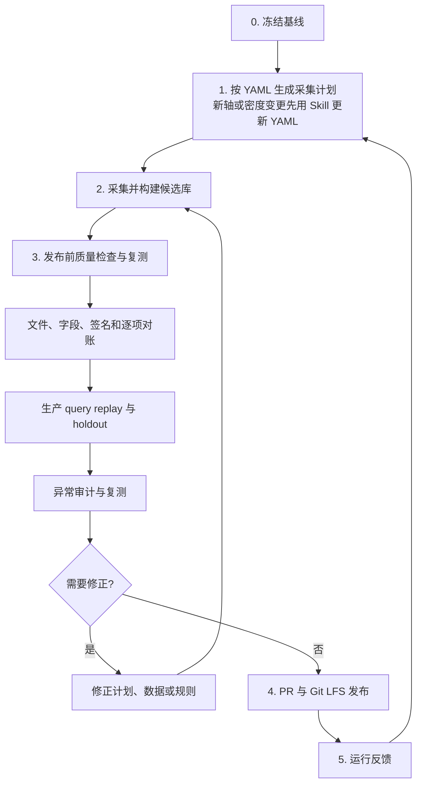

# 实测算子性能数据库生命周期设计

> 仓 `msmodeling` · 路径 `docs/design/profiling_database_lifecycle.md` · 类型 design · MiniMax-M3 文档深读 + 图文关联 · ver=v2
> 原文: extraction/repo_docs/msmodeling/docs/design/profiling_database_lifecycle.md

# 实测算子性能数据库生命周期设计 — 深度解读

## 【定位】

本文定义实测算子性能数据库从采集标准、数据采集、发布前质量检查到发布和运行反馈的**端到端生命周期**，明确"数据库可用的最低条件"和各阶段输入/动作/输出/失败处理，并通过生命周期 Skill 串联已有工具，不另建统一执行器。

---

## 【技术要点】

1. **六阶段闭环流程**：阶段 0（冻结基线）→ 阶段 1（按 YAML 生成采集计划）→ 阶段 2（采集并构建候选库）→ 阶段 3（发布前质量检查与复测）→ 阶段 4（PR 与 Git LFS 发布）→ 阶段 5（运行反馈），运行反馈返回阶段 1 形成下一轮生命周期。

2. **数据库可用的最低条件共 9 条**：覆盖快照可追溯、Shape 逐项对账、关键 query `100% strict exact`、不支持 query 不得回退 roofline、latency 必须正数 finite、CSV 与签名完整性、holdout 不差于基线、唯一严格签名不超过基线 **8 倍**（容量上限而非目标）、快照可由 commit + 目录 + 文件 hash 唯一定位。

3. **YAML 与 Skill 顺序使用**：已有轴且密度不变直接读 YAML；新增轴或修改范围/间隔/比例/必测值必须先调用 `profiling-database-axis-density` Skill 形成变更证据；YAML 未更新前新规则不得进入正式采集计划；采集器**不会因为 YAML 更新自动改变**，必须同步采集器和测试。

4. **阶段 3 三项不可互相替代的检查**：① 文件、字段、签名和逐项对账（计划是否完整、结构是否正确）；② 生产 query replay 与 holdout（数据库能否按真实生产逻辑命中）；③ 异常审计与复测（已存在的 latency 和数据契约是否有可疑点）。异常审计无候选**不等于**数据库通过全部检查。

5. **PR673 异常审计脚本**：`python tools/perf_data_collection/find_database_anomalies.py` 配 `--residual-threshold 1.0` 和 `--remeasure-limit 50`，每次运行自动生成三份报告（`anomaly_summary.md` / `anomaly_candidates.csv` / `remeasure_manifest.csv`），输出目录必须位于数据库外。

6. **采集与合并纪律**：采集只写候选目录不直接修改正式库；自动合并只接受新增签名和无效 latency 补齐；覆盖已有正 latency、删除已有签名、环境变化或冲突时**停止自动合并**；必须保存每次重复测量结果，不能只保存最终平均值。

7. **审计决策制度**：确定性错误必须修复；`REVIEW_REGIME` 先检查签名、分桶或局部边界；单点候选须经独立硬件复测才能修改 latency；`INSUFFICIENT_EVIDENCE` 表示无法判断，**不得视为通过**。

---

## 【关键机制与数据】

### 工作原理（端到端流程）



### 数据流与保护线

- **轴与密度**：YAML 是规范性基线（不是运行时配置），Skill 是新增/修改规则时的定标流程。
- **候选库 → 正式库**：阶段 2 只写候选目录，自动合并受签名、环境、覆盖三类约束保护；阶段 4 通过 PR + Git LFS 发布，不原地替换 CSV，回滚用上一 commit 或 revert。
- **容量保护线**：候选库唯一严格签名数**不超过基线的 8 倍**；query-driven 生成可以减少实际点数但不取消该上限，只有新容量/采集证据才能调整上限。
- **质量门禁**：阶段 3 阶段（4.4.1/4.4.2/4.4.3）任何一项失败都需要返回阶段 0/1/2 修复后**重新执行整个阶段 3**。

### 性能/容量数据（原文有的）

- **8 倍**：唯一严格签名容量上限（防止规模失控，不是目标规模或甜点位）。
- **100% strict exact**：关键 query 命中要求。
- **residual-threshold 1.0**、**remeasure-limit 50**：PR673 异常审计脚本的两个数值参数。
- **三份报告产物**：每次运行脚本固定输出 `anomaly_summary.md`、`anomaly_candidates.csv`、`remeasure_manifest.csv`。
- **四类汇总**：`anomaly_summary.md` 按数据完整性、数据契约、固定阈值性能候选、无法判断四类汇总。

---

## 【表格解读】

### 表 1：阶段 0 冻结基线（原文逐字还原）

| 项目 | 内容 |
| --- | --- |
| 目的 | 确定本轮采集和检查的共同起点。 |
| 输入 | 已发布数据库、代码、`op_mapping.yaml`、密度标准、生产 query、holdout 和测量环境。 |
| 动作 | 记录代码 commit、数据库目录、mapping、密度规则和环境；冻结 query 与 holdout；统计基线有效 latency 和唯一严格签名。 |
| 输出 | 本轮不可变输入及其 hash。 |
| 失败处理 | 输入缺失、冲突或发生变化时重新冻结，不沿用旧结果。 |

**逐行解读**：
- **目的行**：本表先回答"为什么需要阶段 0"——为整轮生命周期确立不可变的起点，避免阶段 1/2/3 在漂移的基线上工作。
- **输入行**：覆盖 7 类输入（已发布数据库、代码、`op_mapping.yaml`、密度标准、生产 query、holdout、测量环境），缺任一项阶段 0 即不成立。
- **动作行**：3 步动作——记录元数据、冻结 query 与 holdout、统计基线指标（有效 latency + 唯一严格签名数），是阶段 1 生成计划时判断"是否超过基线 8 倍"的对照源。
- **输出行**：输出为"不可变输入及其 hash"，目的是后续阶段 3 任意失败都能定位漂移到哪个输入维度。
- **失败处理行**：明确"输入缺失、冲突或发生变化"三种情况都要重新冻结，且不沿用旧结果——这是阶段 0 不可降级使用的硬约束。

---

### 表 2：PR673 异常审计脚本自动生成的报告（原文逐字还原）

| 文件 | 用途 |
| --- | --- |
| `anomaly_summary.md` | 按数据完整性、数据契约、固定阈值性能候选和无法判断四类汇总，作为数据库 PR 的摘要证据。 |
| `anomaly_candidates.csv` | 全部确定性问题、契约风险、LOO 候选和弃权记录。 |
| `remeasure_manifest.csv` | 预算内可定位到具体行的硬件复测目标。 |

**逐行解读**：
- **`anomaly_summary.md` 行**：四类汇总（数据完整性 / 数据契约 / 固定阈值性能候选 / 无法判断）结构对应文中"审计器无法判断的行会明确弃权"的设计——它既是 PR 摘要证据，也是阶段 3.3 通过与否的人工依据。
- **`anomaly_candidates.csv` 行**：覆盖确定性错误、契约风险、LOO（留一法）候选和弃权记录四类结果，是审计的"全量明细"，`LOO` 候选需对应后续独立硬件复测。
- **`remeasure_manifest.csv` 行**：在 `--remeasure-limit 50` 预算内定位到具体行的硬件复测目标；这是连接脚本输出与"阶段 2 重采/复测"的物理交接物。
- **整体**：三份报告分工明确——摘要用于 PR/评审，全量明细用于审计追溯，复测清单用于硬件侧落地。

---

### 表 3：当前状态总览（原文逐字还原）

| 环节 | 当前状态 |
| --- | --- |
| 轴和最低密度 | 已有 Skill、标准文档和 YAML；已有规则直接读 YAML，新轴或规则变更先用 Skill 定标并更新 YAML。 |
| Shape generation、microbench 和 replay | 已有独立工具，按本文人工串联。 |
| 异常审计 | PR673 已实现只读扫描并自动生成三份报告，但当前需要人工执行脚本。 |
| 重复测量记录 | 部分采集入口只保存聚合值，尚未全部保留每次 repeat。 |
| 逐 Shape 对账 | 计划、采集结果和最终入库数据尚未在全部入口一一对应。 |
| 发布前检查 | 当前由现有工具人工串联，尚未接入统一 CI 门禁。 |
| 自动修库 | 不在范围内；统计候选必须独立复测。 |

**逐行解读**：
- **轴密度行**：唯一已"机制完整"的环节——Skill + YAML + 标准文档三件套已就绪，使用顺序也已规定（已有规则直读 YAML，新规则先 Skill 后 YAML）。
- **Shape/microbench/replay 行**：工具本身存在但靠人工串联，是阶段 3 自动化缺口的主要来源之一。
- **异常审计行**：脚本已实现（PR673）但仅人工触发，尚未接入数据库 PR 或 CI，是文中明确的"待自动化"项。
- **重复测量行**：暴露真实数据隐患——部分入口只存聚合值，违反"不能只保存最终平均值"的采集纪律，是阶段 2 的整改重点。
- **逐 Shape 对账行**：与阶段 4.4.1 要求"计划、结果、入库数据逐 Shape 对账"对照，现状是未在全部入口实现，是阶段 3 自动化前的硬伤。
- **发布前检查行**：当前为人工串联、未接 CI 门禁，与最小落地方式"只统一输入快照、逐 Shape 对账和报告目录"形成明确路线。
- **自动修库行**：明确划在范围外——任何"统计候选→自动改库"路径被拒绝，必须独立硬件复测。

---

## 【公式解读】

原文无公式。

（文档以流程图、表格、命令行为主要表达形式，未出现 LaTeX 或伪代码形式的数学公式。）

---

## 【关联】

### 上游/基础能力（本文"连接已有能力，不重复定义"）

- **轴密度 Skill**：`../../.agents/skills/profiling_database_axis_density/SKILL.md` — 新增轴或修改范围、间隔、比例和必测值时的定标流程入口。
- **轴密度 YAML 规则**：`../../.agents/skills/profiling_database_axis_density/axis_collection_density.yaml` — 已批准轴密度的**唯一数值依据**，采集计划按其最低密度生成。
- **采集工具 RFC**：`../RFC/rfc_performance_database_collection_tooling_zh.md` — 定义 CSV、`op_mapping.yaml`、Shape 生成和采集的生产代码路径。
- **异常检测 RFC**（PR673）：`docs/RFC/rfc_profiling_database_anomaly_detection_zh.md` — 当前分支路径尚不存在，待 PR673 合入后生效，引入只读脚本与三份报告产物。

### 上下游模块关系

- **生命周期 Skill**：`../../.agents/skills/profiling_database_lifecycle/SKILL.md` — 是本文的实际执行入口，调用上述轴密度 Skill 与采集工具，不另建统一执行器。
- **运行反馈 → 阶段 1**：阶段 5 的归因结果（exact miss / 插值失败 / mapping miss / composite 子查询 miss / 精度回归 / 审计候选）回写为下一轮采集计划的输入。
- **阶段 3 → 阶段 0/1/2 的回退**：任何数据或规则修正都必须**重新执行整个阶段 3**；缺数据回阶段 1 或 2；输入版本变化回阶段 0。

### 关键边界

- "尚未统一"不表示必须建设大型平台——最小落地方式是保留现有工具，只统一**输入快照、逐 Shape 对账和报告目录**，条件成熟后再把稳定检查接入数据库 PR。
- PR673 未合入时，**异常审计阶段不可执行**，这是阶段 3 当前的能力缺口。

---

## 【使用方法】

### 启用方式

- 本文本身是设计文档，**执行入口为生命周期 Skill**：`../../.agents/skills/profiling_database_lifecycle/SKILL.md`。
- 生命周期 Skill 调用现有 Skill 和工具，不另建统一执行器。

### 配置项 / 关键命令

#### 异常审计脚本（阶段 4.4.3 原文命令，逐字保留）

```bash
python tools/perf_data_collection/find_database_anomalies.py \
  --database-path <candidate-database> \
  --output-dir <database-outside-report-directory> \
  --residual-threshold 1.0 \
  --remeasure-limit 50
```

- `--residual-threshold 1.0`：固定阈值性能候选的残差阈值。
- `--remeasure-limit 50`：复测清单预算上限（即可定位到具体行的硬件复测目标数量上限）。
- `--output-dir` **必须位于数据库外**，建议按日期和数据库 snapshot hash 保存。

#### 容量上限（阶段 3 发布前硬约束）

- 候选库唯一严格签名数 ≤ 基线 **8 倍**（超出则不进入采集，需新容量/采集证据才能调整）。

#### 关键 query 命中要求（阶段 4.4.2）

- 关键 query 必须 `100% strict exact`；
- 其他支持 query 必须 exact、明确 compatible 或合法同桶插值，**不得回退 roofline**；
- 冻结 holdout 不得差于批准的生产基线。

#### 审计决策制度（阶段 4.4.3）

- `REVIEW_REGIME`：先检查签名、分桶或局部边界；
- `INSUFFICIENT_EVIDENCE`：表示无法判断，不得视为通过；
- 单点候选必须经独立硬件复测后才能修改 latency。

#### YAML 使用顺序（阶段 1）

1. 已有轴且密度不变 → 直接读 `axis_collection_density.yaml`；
2. 新增轴或修改范围/间隔/比例/必测值 → 先调用 `profiling-database-axis-density` Skill 形成变更证据；
3. 规则通过评审后更新 YAML；YAML 未更新前新规则不得进入正式采集计划；
4. 用"YAML 最低密度 + 冻结的真实 query + 复合算子实际子 query"生成候选 Shape，再用实际 Shape generator 校验并按严格签名去重。

> 原文未涉及 CI 接入方式、自动触发命令或 Git LFS 推送脚本——这些被明确划归"条件成熟后"再建设的内容。
